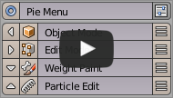
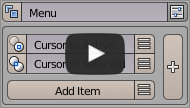
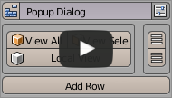
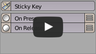
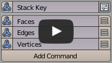
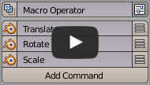
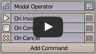
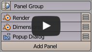
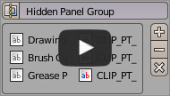
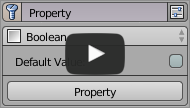

(feature-overview)=

# Feature Overview

```{todo}
Replace images with gifs. Youtube links moved to their own section.
```

````{grid} 1
:gutter: 3
:class-container: sd-p-4

```{grid-item-card} Pie Menu Editor
:link: ../editors/pie_menu_editor.html
:class-card: sd-shadow-md sd-rounded-3 feature-card
:class-header: sd-text-center sd-font-weight-bold
:class-body: sd-text-left



Create radial menus with 8+ customizable buttons, perfect for quick access to frequently used tools. Supports nesting menus and display panels to organize complex workflows.
```

```{grid-item-card} Regular Menu Editor
:link: ../editors/regular_menu_editor.html
:class-card: sd-shadow-md sd-rounded-3 feature-card
:class-header: sd-text-center sd-font-weight-bold
:class-body: sd-text-left



Design multi-column dropdown menus that can be triggered by hotkeys or integrated into existing menus. Ideal for grouping related commands and settings.
```

```{grid-item-card} Pop-up Dialog Editor
:link: ../editors/popup_dialog_editor.html
:class-card: sd-shadow-md sd-rounded-3 feature-card
:class-header: sd-text-center sd-font-weight-bold
:class-body: sd-text-left



Build custom widget layouts that can be displayed anywhere - in menus, dialogs, panels, or toolbars. Seamlessly integrate with Blender's UI system.
```

```{grid-item-card} Sticky Key Editor
:link: ../editors/sticky_key_editor.html
:class-card: sd-shadow-md sd-rounded-3 feature-card
:class-header: sd-text-center sd-font-weight-bold
:class-body: sd-text-left



Configure different actions for key press and release events. Essential for temporary tool activation or mode switching during operations.
```

```{grid-item-card} Stack Key Editor
:link: ../editors/stack_key_editor.html
:class-card: sd-shadow-md sd-rounded-3 feature-card
:class-header: sd-text-center sd-font-weight-bold
:class-body: sd-text-left



Assign multiple commands to a single hotkey and cycle through them. Streamline your workflow by reducing the number of required shortcuts.
```

```{grid-item-card} Macro Operator Editor
:link: ../editors/macro_operator_editor.html
:class-card: sd-shadow-md sd-rounded-3 feature-card
:class-header: sd-text-center sd-font-weight-bold
:class-body: sd-text-left



Create new tools by combining existing Blender operations - no coding required. Automate complex workflows with simple button clicks.
```

```{grid-item-card} Modal Operator Editor
:link: ../editors/modal_operator_editor.html
:class-card: sd-shadow-md sd-rounded-3 feature-card
:class-header: sd-text-center sd-font-weight-bold
:class-body: sd-text-left



Develop interactive tools that respond to user input. Perfect for custom manipulation tools and dynamic operations.
```

```{grid-item-card} Side Panel Editor
:link: ../editors/ui_customization.html#side-panel-editor
:class-card: sd-shadow-md sd-rounded-3 feature-card
:class-header: sd-text-center sd-font-weight-bold
:class-body: sd-text-left



Organize and customize Blender's interface by grouping and managing panels. Create new tabs or extend existing categories with custom panels.
```

```{grid-item-card} Hiding Unused Panels
:link: ../editors/ui_customization.html#hiding-unused-panels
:class-card: sd-shadow-md sd-rounded-3 feature-card
:class-header: sd-text-center sd-font-weight-bold
:class-body: sd-text-left



Declutter Blender's interface by selectively hiding unwanted panels and groups. Keep your workspace focused and efficient by showing only what you need.
```

```{grid-item-card} Property Editor
:link: ../editors/property_editor.html
:class-card: sd-shadow-md sd-rounded-3 feature-card
:class-header: sd-text-center sd-font-weight-bold
:class-body: sd-text-left



Create and manage custom properties for objects, materials, and more. Extend Blender's property system with your own controls and settings.
```

````