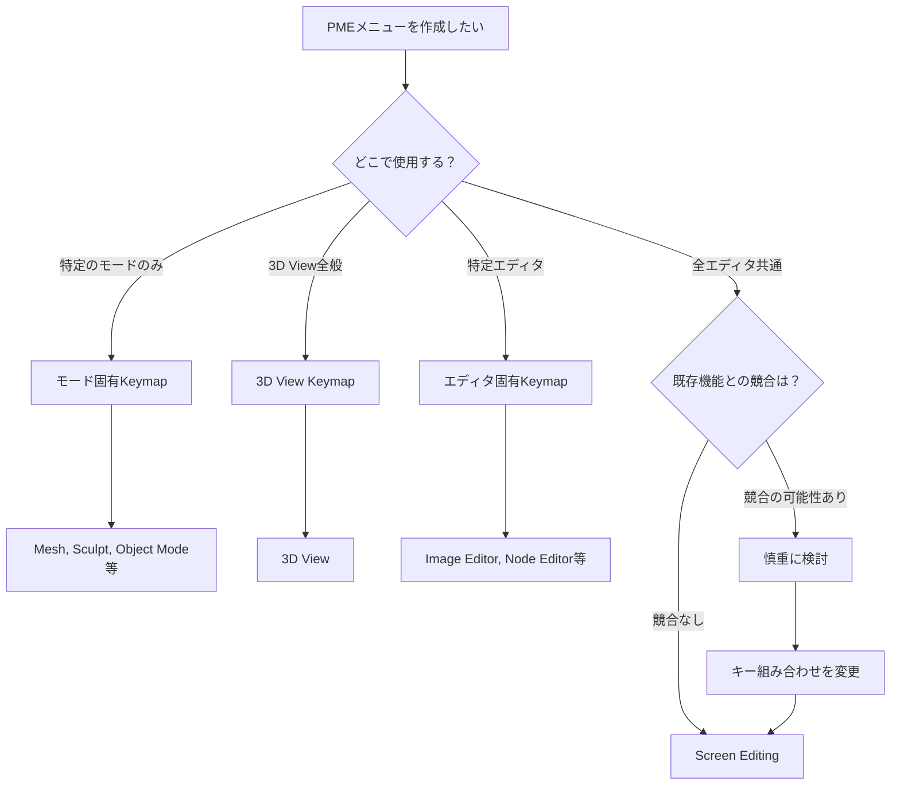

# PME Keymap選択ガイド

PMEでカスタムメニューを作成する際、適切なKeymapを選択することは重要です。
このガイドでは、Blenderのキーマップシステムの仕組みを理解し、目的に応じた最適なKeymapを選択する方法を説明します。

## Blenderキーマップの基本構造

### 階層システム
BlenderのKeymapは**階層構造**になっており、より具体的（優先度の高い）キーマップが先に処理されます。

```
Screen Editing (全体)
├── 3D View (3D Viewエリア全体)
│   ├── Mesh (メッシュ編集モード)
│   ├── Object Mode (オブジェクトモード)
│   ├── Sculpt (スカルプトモード)
│   └── その他のモード...
├── Image Editor (画像エディタ)
├── Outliner (アウトライナー)
└── その他のエディタ...
```

### 優先度の仕組み
1. **モード固有のKeymap** (例: `Mesh`, `Sculpt`) - 最優先
2. **エディタ固有のKeymap** (例: `3D View`, `Image Editor`)
3. **全体共通のKeymap** (例: `Screen Editing`) - 最低優先度

## 主要なKeymap一覧

### 3D View関連

#### モード別Keymap（高優先度）

:::{list-table} 3D Viewモード別Keymap
:header-rows: 1
:widths: 25 25 50

* - Keymap名
  - 対応モード
  - 用途・説明
* - `Mesh`
  - Edit Mode (Mesh)
  - メッシュ編集時の操作。頂点・辺・面の選択や変形に最適
* - `Object Mode`
  - Object Mode
  - オブジェクトの選択・移動・追加・削除など基本操作
* - `Sculpt`
  - Sculpt Mode
  - スカルプト専用の操作。ブラシ切り替えやスカルプト設定
* - `Weight Paint`
  - Weight Paint Mode
  - ウェイトペイント時の操作。ブラシ設定やウェイト調整
* - `Vertex Paint`
  - Vertex Paint Mode
  - 頂点ペイント時の操作。色の塗り分けや設定
* - `Pose`
  - Pose Mode
  - アーマチュアのポーズ設定。ボーンの選択・回転・IK
* - `Armature`
  - Edit Mode (Armature)
  - アーマチュア編集。ボーンの追加・削除・調整
* - `Curve`
  - Edit Mode (Curve)
  - カーブ・NURBS編集。制御点やハンドル操作
* - `Font`
  - Edit Mode (Text)
  - テキストオブジェクト編集。文字入力や書式設定
:::

#### 特殊なKeymap

:::{list-table} 3D View特殊Keymap
:header-rows: 1
:widths: 25 50 25

* - Keymap名
  - 説明
  - 優先度
* - `Paint Face Mask`
  - ペイントモードでのフェースマスク操作
  - 最高
* - `Paint Vertex Selection`
  - ペイントモードでの頂点選択操作
  - 最高
* - `3D View Generic`
  - 3D View共通操作（ビュー回転、ズーム等）
  - 低
* - `3D View`
  - 3D Viewの基本操作
  - 最低
:::

### エディタ別Keymap

:::{list-table} 主要エディタのKeymap
:header-rows: 1
:widths: 25 25 50

* - エディタ
  - Keymap名
  - 用途
* - **画像エディタ**
  - `Image Editor`
  - UV展開、テクスチャペイント
* - **ノードエディタ**
  - `Node Editor`
  - マテリアル・ジオメトリノード編集
* - **アウトライナー**
  - `Outliner`
  - オブジェクト階層の管理
* - **プロパティパネル**
  - `Property Editor`
  - オブジェクト・マテリアルプロパティ
* - **ドープシート**
  - `Dopesheet`
  - アニメーションキーフレーム編集
* - **タイムライン**
  - `Timeline`
  - アニメーション再生・時間制御
:::

### 全体共通Keymap

:::{list-table} 全体共通Keymap
:header-rows: 1
:widths: 25 75

* - Keymap名
  - 説明
* - `Screen Editing`
  - **全エリア・全モードで有効**。最も汎用的だが既存機能との競合リスクが高い
* - `Window`
  - ウィンドウ全体の操作（ファイル保存・終了等）
* - `Screen`
  - 画面・ワークスペース管理
:::

#### Screen系Keymapの実装レベルでの違い

BlenderのScreen系Keymapは似た名前で混乱しやすいですが、ソースコード実装において明確な技術的区別があります。

### 実装における登録方法の違い

Blenderソースコード（`wm_window.cc`）では、以下のように異なる方法で登録されています：

```cpp
// Window Keymap - 通常ハンドラーに登録
wmKeyMap *keymap = WM_keymap_ensure(wm->defaultconf, "Window", SPACE_EMPTY, RGN_TYPE_WINDOW);
WM_event_add_keymap_handler(&win->handlers, keymap);

// Screen Keymap - 通常ハンドラーに登録  
keymap = WM_keymap_ensure(wm->defaultconf, "Screen", SPACE_EMPTY, RGN_TYPE_WINDOW);
WM_event_add_keymap_handler(&win->handlers, keymap);

// Screen Editing Keymap - モーダルハンドラーに登録（重要な違い）
keymap = WM_keymap_ensure(wm->defaultconf, "Screen Editing", SPACE_EMPTY, RGN_TYPE_WINDOW);
WM_event_add_keymap_handler(&win->modalhandlers, keymap);
```

### スコープと処理優先度

**共通のスコープ定義:**
3つのKeymapは全て同一のスコープパラメータを持ちます：
- `SPACE_EMPTY`: 特定エディタに依存しない
- `RGN_TYPE_WINDOW`: ウィンドウ全体対象

**実際の処理優先度（`wm_event_system.cc`の実装順序）:**

```cpp
void wm_event_do_handlers(bContext *C) {
    // 1. Modal handlers（最高優先度）
    action |= wm_handlers_do(C, event, &win->modalhandlers);  // Screen Editing
    
    // 2. Area region handlers（中間優先度）
    action |= wm_event_do_handlers_area_regions(C, event, area);
    
    // 3. Area handlers（中間優先度）
    action |= wm_handlers_do(C, event, &area->handlers);
    
    // 4. Window handlers（最低優先度）
    action |= wm_handlers_do(C, event, &win->handlers);  // Window, Screen
}
```

### 技術的な使い分け根拠

**1. Screen Editing Keymap**
- **実装**: `win->modalhandlers`に登録
- **優先度**: **最高**（モーダルハンドラーとして最初に処理）
- **技術的特徴**: 他の全てのKeymapより先に評価される
- **適用場面**: 
  - 絶対に干渉されたくない操作
  - モーダル状態中でも確実に実行したい操作
  - UI構造変更の重要操作

**2. Window Keymap**  
- **実装**: `win->handlers`に登録
- **優先度**: **最低**（通常ハンドラーの一部）
- **技術的特徴**: Areaハンドラー処理後のフォールバック
- **適用場面**:
  - アプリケーション全体のグローバル操作
  - ファイル管理系操作
  - 他のKeymapで処理されない基本操作

**3. Screen Keymap**
- **実装**: `win->handlers`に登録（Windowと同階層）  
- **優先度**: **最低**（Windowと同じ通常ハンドラー）
- **技術的特徴**: Window Keymapと同優先度
- **適用場面**:
  - スクリーン・ワークスペース管理
  - 汎用的なフレーム操作
  - 最低優先度で十分な操作

### 実装レベルでの競合処理

同じキーを異なるKeymapに割り当てた場合の実行順序：

```
1. Screen Editing (modalhandlers) ← 最優先で実行
2. Area Region Keymaps (例: Mesh, 3D View等)
3. Area Keymaps  
4. Window / Screen (handlers) ← 最後に実行（同優先度）
```

:::{admonition} PME使用時の技術的な選択指針
:class: important

**Screen Editing を選択すべき場合:**
- **他のKeymapに絶対優先したい操作**
- モーダル操作中でも確実に実行したい機能
- UI構造変更など重要度の高い操作

**Window を選択すべき場合:**  
- **アプリケーション全体の基本操作**
- ファイル管理・設定系の汎用操作
- 他のKeymapで処理されないフォールバック操作

**Screen を選択すべき場合:**
- **ワークスペース・レイアウト管理**
- フレーム操作など画面制御系
- Window Keymapと同優先度で十分な操作

**競合回避の実践例:**
```python
# 同じShift+Aキーを使用する場合の処理順序
1. Screen Editing: Shift+A → 最優先で実行
2. Mesh Keymap: Shift+A → メッシュ編集モード時のみ実行  
3. Window: Shift+A → 上記で処理されなかった場合に実行
```
:::

この実装レベルでの理解により、PMEユーザーは技術的根拠を持って適切なKeymapを選択し、意図した動作を確保できます。

## 実用的な選択指針

### 1. 特定モードでの専用メニュー

**目的**: 特定の作業モードでのみ使用したい機能

**推奨Keymap**: モード固有のKeymap（`Mesh`, `Sculpt`等）

**例**:
- メッシュモデリング用パイメニュー → `Mesh`
- スカルプト用ブラシ切り替えメニュー → `Sculpt`
- ポーズ設定用メニュー → `Pose`

**メリット**: 
- そのモードでのみ動作し、他のモードに影響しない
- モード固有の機能に集中できる

### 2. 3D View全般で使用するメニュー

**目的**: 3D Viewのどのモードでも使いたい汎用機能

**推奨Keymap**: `3D View`

**例**:
- ビューポート表示切り替えメニュー
- よく使うオブジェクト追加メニュー
- 汎用的な変形操作メニュー

**メリット**:
- 3D Viewのすべてのモードで一貫して使用可能
- ビュー操作と相性が良い

### 3. 全エディタで使用するメニュー

**目的**: どのエディタでも使いたいグローバル機能

**推奨Keymap**: `Screen Editing`

**例**:
- ファイル操作メニュー
- レンダリング関連メニュー
- アドオン管理メニュー

**注意事項**:
- 既存の重要な機能（LMB、RMB等）を上書きしないよう注意
- 全エディタに影響するため、慎重に設計する

### 4. 特定エディタでの専用メニュー

**目的**: 特定のエディタでの専門的な作業

**推奨Keymap**: エディタ固有のKeymap

**例**:
- UV編集用メニュー → `Image Editor`
- ノード作成メニュー → `Node Editor`
- アニメーション制御メニュー → `Dopesheet`

## 実際の選択フローチャート



## よくある間違いと対策

### ❌ 間違った選択例

1. **Screen Editingで基本操作を上書き**
   - `Space`キーでScreen Editingに登録 → 検索機能が無効化
   - `Tab`キーでScreen Editingに登録 → モード切り替えが無効化

2. **適用範囲が広すぎるKeymap選択**
   - スカルプト専用機能を`3D View`に登録 → 他のモードで不要なメニュー表示

3. **適用範囲が狭すぎるKeymap選択**
   - 汎用的な機能を`Mesh`だけに登録 → 他のモードで使用不可

### ✅ 正しい対策

1. **既存機能の確認**
   ```python
   # PMEのHotkey設定で+ボタンを使用して既存キーを調査
   # 競合しない組み合わせを選択
   ```

2. **段階的なテスト**
   ```
   1. 狭い範囲（特定モード）でテスト
   2. 問題なければ徐々に範囲を拡大
   3. 最終的に適切なKeymapを選択
   ```

3. **バックアップの作成**
   ```
   - PME設定をエクスポート
   - 変更前の状態を保存
   - 問題があれば即座に復元可能な状態を維持
   ```

## 高度なテクニック

### Poll関数の活用

特定の条件でのみメニューを表示したい場合は、Poll Methodを組み合わせて使用します：

```python
# メッシュオブジェクトが選択されている場合のみ表示
return C.active_object and C.active_object.type == 'MESH'

# 編集モードかつ面選択モードの場合のみ表示
return C.mode == 'EDIT_MESH' and C.tool_settings.mesh_select_mode[2]

# スカルプトモードかつDyntopoが有効な場合のみ表示
return C.mode == 'SCULPT' and C.active_object.use_dynamic_topology_sculpting
```

### キーマップの組み合わせ戦略

複数のKeymapを組み合わせて、階層的なメニューシステムを構築：

```
Screen Editing: Shift+A → メイン作成メニュー
├─ 3D View: Shift+Alt+A → 3D View専用作成メニュー
├─ Mesh: Shift+Ctrl+A → メッシュ編集専用メニュー
└─ Sculpt: Shift+S → スカルプトブラシメニュー
```

## デバッグとトラブルシューティング

### メニューが表示されない場合

1. **Keymapの優先度を確認**
   ```python
   # より具体的なKeymapで同じキーが使用されていないか確認
   # Blender Preferences > Keymap で検索
   ```

2. **Poll関数の動作確認**
   ```python
   # Poll Method欄で条件を簡素化してテスト
   return True  # 常に表示（デバッグ用）
   ```

3. **PMEログの確認**
   ```python
   # System Console (Window > Toggle System Console) でエラー確認
   ```

### 既存機能が動作しなくなった場合

1. **競合するキーマップアイテムを特定**
2. **キー組み合わせを変更**
3. **必要に応じてKeymapを変更**

## まとめ

適切なKeymap選択により、PMEメニューを効率的に配置できます：

- **特定モード専用** → モード固有Keymap
- **エディタ内汎用** → エディタ固有Keymap  
- **グローバル機能** → Screen Editing（注意深く）

常に既存機能との競合を避け、段階的にテストしながら実装することが重要です。